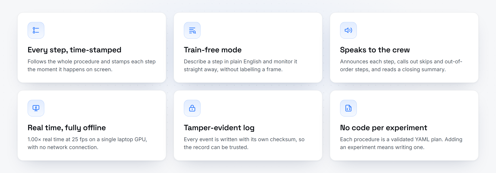
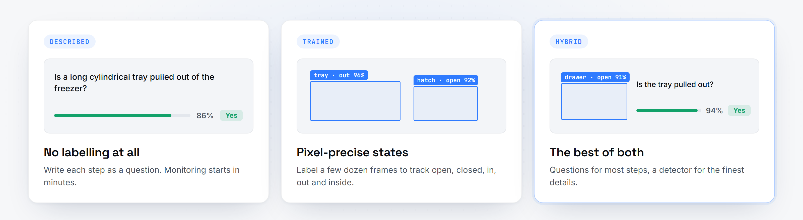

<a id="top"></a>

<p align="center">
  
</p>

<p align="center">
  
  
  
  
  
</p>

<p align="center">
  <b>An on-board AI that follows a science procedure the way a ground controller would.</b><br>
  It recognises every step as it happens and speaks up the moment one is skipped or done out of order,<br>
  in real time, on a single laptop GPU, with no network connection.
</p>

<p align="center">
  <a href="#quick-start"><b>Quick start</b></a> ·
  <a href="#how-it-works"><b>How it works</b></a> ·
  <a href="USP.md"><b>Why BAS-HAR</b></a> ·
  <a href="docs/assets/demo.mp4"><b>Watch the demo</b></a>
</p>

<br>

<p align="center">
  
</p>
<p align="center">
  <sub>Real ISS footage of the MELFI −80 °C freezer procedure. Recognised automatically, every step followed in order, zero alerts. Shown at 3× speed.</sub>
</p>

<details>
<summary><b>Table of contents</b></summary>

- [Why it matters](#why-it-matters)
- [Features](#features)
- [Gallery](#gallery)
- [Three ways to teach it](#three-ways-to-teach-it)
- [How it works](#how-it-works)
- [Quick start](#quick-start)
- [Performance](#performance)
- [FAQ](#faq)
- [Documentation](#documentation)
- [Built with](#built-with)
- [Acknowledgements](#acknowledgements)

</details>

## Why it matters

Science on the space station runs to written procedures. A skipped step, such as a tray left
out of a −80 °C freezer, can cost a sample that took months to prepare. Crews have little time and
ground teams cannot watch every minute. **BAS-HAR** watches the procedure for them, checks every
step against the plan and alerts the crew immediately, all on the station's own hardware.

## Features

<p align="center">
  
</p>

- **Proven on real space-station footage.** Follows all 8 steps of the MELFI sample-stowage
  procedure in order, each within about a second of the moment it happens, with zero false alerts.
- **Sees object states, not just objects.** Hatches open and closed, trays in and out, a sample
  *inside* a compartment.
- **Understands the whole procedure.** A deterministic engine catches skipped, out-of-order and
  stalled steps, so every alert traces back to a rule you can read.
- **Recognises the experiment by itself.** Drop in a video and BAS-HAR matches its scenes against
  every procedure in the library.

<p align="right"><a href="#top">Back to top ↑</a></p>

## Gallery

<table>
  <tr>
    <td width="50%"></td>
    <td width="50%"></td>
  </tr>
  <tr>
    <td><sub><b>Live.</b> Detections, the step timeline with completion times, and evidence for the step in progress.</sub></td>
    <td><sub><b>Complete.</b> 8 of 8 steps, in order, zero alerts. Every step stamped with the moment it happened.</sub></td>
  </tr>
</table>

## Three ways to teach it

<p align="center">
  
</p>


**Describe it, don't train it.** Objects are described in words and each step is a yes/no
question about the camera frame:

```yaml
- id: step_02
  description: A tray is pulled out of the freezer.
  evidence:
    - kind: visual_question
      question: "Is a long cylindrical tray pulled out of the freezer?"
      expect: "yes"
```

A Qwen3-VL model running locally reads the whole question set in one pass, in about 0.4 seconds,
and returns a calibrated probability for each answer. Anything between 40% and 60% counts as
*unsure* and never ticks a box by itself.

For pixel-precise work, label a few dozen frames in the built-in **Training Studio** and train a
YOLO11 detector, or combine both in one **hybrid** plan.

<br clear="right">

<p align="right"><a href="#top">Back to top ↑</a></p>

## How it works

<p align="center">
  
</p>

1. **Perception** turns each frame into evidence: trained detections with states, objects found
   from descriptions, answers to plain-English questions, and pose and hands when a plan needs them.
2. **The procedure engine** checks that evidence against the plan. A step completes when its
   evidence holds across a short sliding window, so a single bad frame never raises a false alarm.
3. **Output** is immediate: a live dashboard, spoken announcements, a checksummed event log and,
   for live cameras, a rolling recording.

## Quick start

```bash
py -3.11 -m venv .venv
.\.venv\Scripts\python.exe -m pip install -e ".[perception,streaming,voice,studio,dev]"
cd web && npm install && npm run build && cd ..
```

```bash
startup.bat                     # Operations dashboard at http://127.0.0.1:5767
startup_training_studio.bat     # Training Studio
cmd /c startup.bat test         # tests, lint and build
```

Drop an experiment video onto the page, or connect a camera or RTSP stream. Windows 10/11 with an
NVIDIA GPU is recommended; it also runs on CPU.

<p align="right"><a href="#top">Back to top ↑</a></p>

## Performance

<sub>Measured on an RTX 5050 Laptop GPU (8 GB).</sub>

| Measure | Result |
|---|---|
| Playback | **1.00×** real time at **25 fps** |
| Trained detection | **~10 ms** per frame |
| Vision-language answers | full question set in **~0.4 s**, off the video path |
| MELFI procedure | **8 / 8** steps, in order, **0** false alerts |

## FAQ

<details>
<summary><b>Does it need an internet connection?</b></summary>
<br>
No. Every model runs locally, the dashboard fonts are bundled, and nothing leaves the machine.
</details>

<details>
<summary><b>How do I add a new experiment?</b></summary>
<br>
Write a YAML plan: the objects, the steps in order, and the evidence for each step. The plan is
validated before it can run. No Python changes are needed.
</details>

<details>
<summary><b>Do I have to label data?</b></summary>
<br>
Not to start. In described mode each step is a plain-English question. Label frames only when you
want pixel-precise object states from a trained detector.
</details>

<details>
<summary><b>What happens when a step is skipped?</b></summary>
<br>
The alert is spoken straight away, ahead of any queued announcement, shown on the dashboard and
written to the event log with the time it happened.
</details>

<details>
<summary><b>Can it watch a live camera?</b></summary>
<br>
Yes. Connect a webcam or an RTSP stream from the dashboard. Live sessions also keep a rolling
recording, so every alert can be reviewed afterwards.
</details>

## Documentation

| Document | What it covers |
|---|---|
| [USP.md](USP.md) | What makes BAS-HAR different |
| [BOXING_GUIDE.md](BOXING_GUIDE.md) | Labelling video, written for non-programmers |
| [training_guide.md](training_guide.md) | The Training Studio, end to end |
| [docs/architecture.md](docs/architecture.md) | System design in depth |
| [docs/validation_matrix.md](docs/validation_matrix.md) | What has been verified, and how |

## Built with

<p>
  
  
  
  
  
  
  
  
</p>

## Acknowledgements

Demonstration footage: ESA (European Space Agency), Ignis mission, used with credit for research
demonstration. Built on [Ultralytics YOLO11 and YOLOE](https://github.com/ultralytics/ultralytics),
[Qwen3-VL](https://github.com/QwenLM/Qwen3-VL), [MediaPipe](https://github.com/google-ai-edge/mediapipe),
[PyTorch](https://pytorch.org) and [React](https://react.dev). Typefaces: Inter, JetBrains Mono and
Space Grotesk (SIL Open Font License). README layout inspired by
[awesome-readme](https://github.com/matiassingers/awesome-readme).

<p align="center"><sub>Built for SIH26174 · AI Human Activity Recognition for on-board BAS experiments</sub></p>
<p align="right"><a href="#top">Back to top ↑</a></p>
