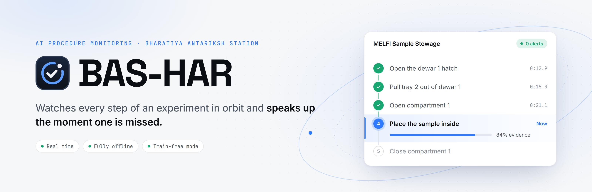
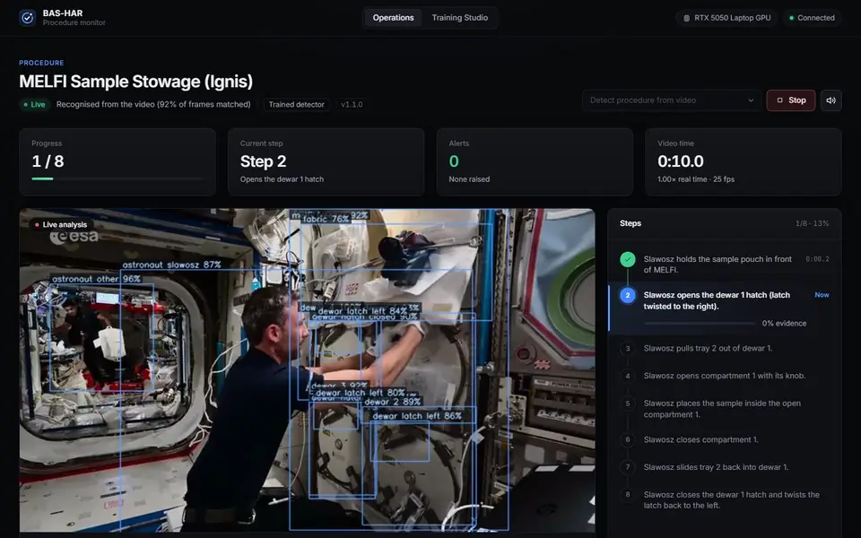
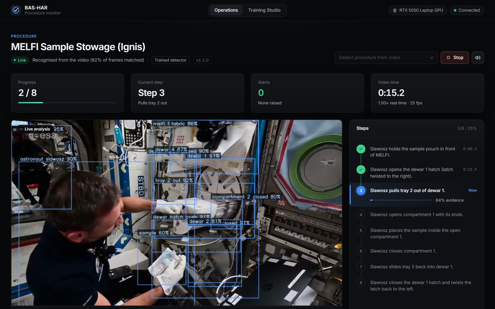
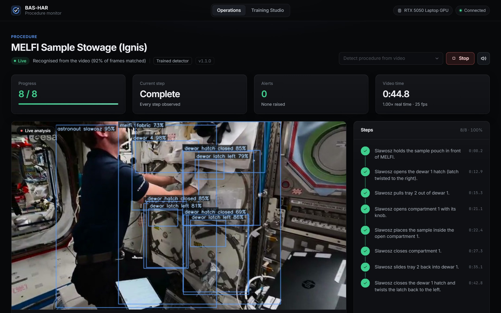
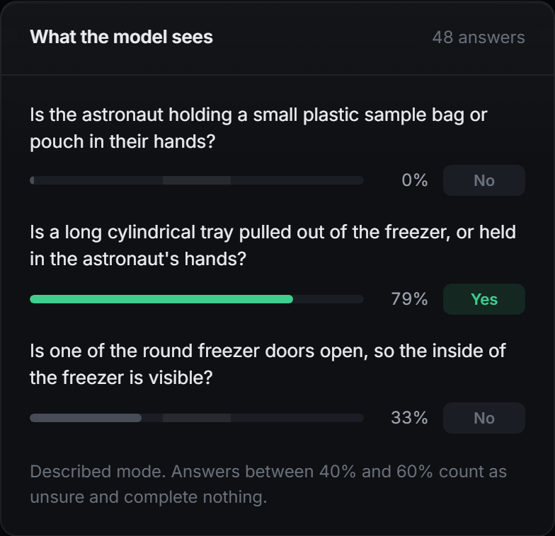
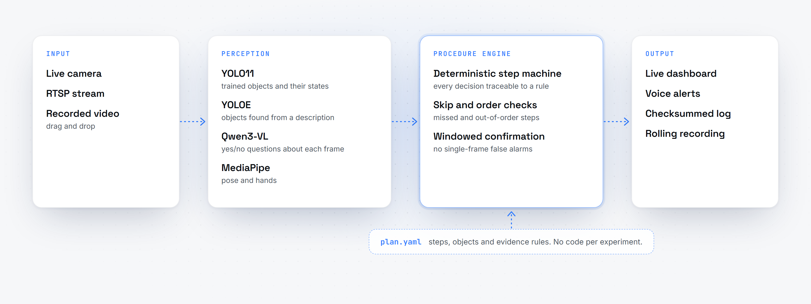

<p align="center">
  <picture>
    <source media="(prefers-color-scheme: dark)" srcset="docs/assets/banner-dark.png">
    <source media="(prefers-color-scheme: light)" srcset="docs/assets/banner-light.png">
    
  </picture>
</p>

<p align="center">
  
  
  
  
  
</p>

<p align="center">
  <a href="#highlights">Highlights</a> ·
  <a href="#describe-it-dont-train-it">Train-free mode</a> ·
  <a href="#how-it-works">How it works</a> ·
  <a href="#quick-start">Quick start</a> ·
  <a href="USP.md">Why BAS-HAR</a>
</p>

<br>

**BAS-HAR** is an on-board AI that follows a science procedure the way a ground controller would.
It watches the astronaut, recognises every step as it happens, and calls out the moment a step is
skipped or done out of order, in real time, on a single laptop GPU, with no network connection.

<p align="center">
  
</p>
<p align="center">
  <sub>Real ISS footage of the MELFI −80 °C freezer procedure. Recognised automatically, all 8 steps followed in order, zero alerts. Shown at 3× speed. <a href="docs/assets/demo.mp4">Full-quality video</a>.</sub>
</p>

## Highlights

- **Proven on real space-station footage.** Follows all 8 steps of the MELFI sample-stowage procedure
  in order, each within about a second of the moment it happens on screen, with zero false alerts.
- **Describe it, don't train it.** Write a procedure in plain English and monitor it immediately. A
  local vision-language model answers each step's question several times a second.
- **Sees object states, not just objects.** Hatches open and closed, trays in and out, a sample
  *inside* a compartment. Every step is checked against evidence you can read.
- **Understands the whole procedure.** Catches skipped, out-of-order and stalled steps with a
  deterministic engine, so every alert traces back to a rule.
- **Talks to the crew.** Each step is announced as it completes, alerts jump the queue, and a
  spoken summary closes the session.
- **Real time on a laptop.** 1.00× real time at 25 fps on an 8 GB GPU, fully offline.
- **Audit-grade log.** Every event is written with its own checksum, so the record is tamper-evident.
- **No code per experiment.** Each procedure is a YAML plan, validated before it can run.

## See it in action

<table>
  <tr>
    <td width="50%"></td>
    <td width="50%"></td>
  </tr>
  <tr>
    <td><sub><b>Live.</b> Detections, the step timeline with completion times, and evidence for the step in progress.</sub></td>
    <td><sub><b>Complete.</b> 8 of 8 steps, in order, zero alerts. Every step stamped with the moment it happened.</sub></td>
  </tr>
</table>

## Describe it, don't train it

Teaching BAS-HAR a new experiment can be as simple as writing it down. Objects are described in
words and each step is a yes/no question about the camera frame:

```yaml
steps:
  - id: step_02
    description: A tray is pulled out of the freezer.
    evidence:
      - kind: visual_question
        question: "Is a long cylindrical tray pulled out of the freezer, or held in the astronaut's hands?"
        expect: "yes"
```



A Qwen3-VL model running locally reads the whole question set in a single pass, about 0.4 seconds,
and returns a calibrated probability for each answer. Anything between 40% and 60% counts as
*unsure* and never ticks a box by itself.

For pixel-precise work, label a few dozen frames in the built-in **Training Studio** and train a
YOLO11 detector. Or combine both in a single **hybrid** plan: questions for most steps, a trained
detector for the finest details.

<br clear="right">

## How it works

<p align="center">
  <picture>
    <source media="(prefers-color-scheme: dark)" srcset="docs/assets/architecture-dark.png">
    <source media="(prefers-color-scheme: light)" srcset="docs/assets/architecture-light.png">
    
  </picture>
</p>

1. **Perception** turns each frame into evidence: trained detections with states, objects found
   from descriptions, answers to plain-English questions, and pose and hands when a plan needs them.
2. **The procedure engine** checks that evidence against the plan. A step completes when its
   evidence holds across a short sliding window, so a single bad frame never raises a false alarm.
3. **Output** is immediate: a live dashboard, spoken announcements, a checksummed event log and,
   for live cameras, a rolling recording.

Drop in a video and BAS-HAR works out which experiment it shows by itself, by comparing its scenes
with every procedure in its library.

## Quick start

```bash
py -3.11 -m venv .venv
.\.venv\Scripts\python.exe -m pip install -e ".[perception,streaming,voice,studio,dev]"
cd web && npm install && npm run build && cd ..
```

```bash
startup.bat                     # Operations dashboard at http://127.0.0.1:5767
startup_training_studio.bat     # Training Studio
cmd /c startup.bat test         # tests, lint and build
```

Drop an experiment video onto the page, or connect a camera or RTSP stream. Windows 10/11 with an
NVIDIA GPU is recommended; it also runs on CPU.

## Performance

<sub>Measured on an RTX 5050 Laptop GPU (8 GB).</sub>

| Measure | Result |
|---|---|
| Playback | **1.00×** real time at **25 fps** |
| Trained detection | **~10 ms** per frame |
| Vision-language answers | full question set in **~0.4 s**, off the video path |
| MELFI procedure | **8 / 8** steps, in order, **0** false alerts |

## Documentation

| Document | What it covers |
|---|---|
| [USP.md](USP.md) | What makes BAS-HAR different |
| [BOXING_GUIDE.md](BOXING_GUIDE.md) | Labelling video, written for non-programmers |
| [training_guide.md](training_guide.md) | The Training Studio, end to end |
| [docs/architecture.md](docs/architecture.md) | System design in depth |
| [docs/validation_matrix.md](docs/validation_matrix.md) | What has been verified, and how |

## Acknowledgements

Demonstration footage: ESA (European Space Agency), Ignis mission, used with credit for research
demonstration. Built on [Ultralytics YOLO11 and YOLOE](https://github.com/ultralytics/ultralytics),
[Qwen3-VL](https://github.com/QwenLM/Qwen3-VL), [MediaPipe](https://github.com/google-ai-edge/mediapipe),
[PyTorch](https://pytorch.org) and [React](https://react.dev). Typefaces: Inter, JetBrains Mono and
Space Grotesk (SIL Open Font License).

<p align="center"><sub>Built for SIH26174 · AI Human Activity Recognition for on-board BAS experiments</sub></p>
